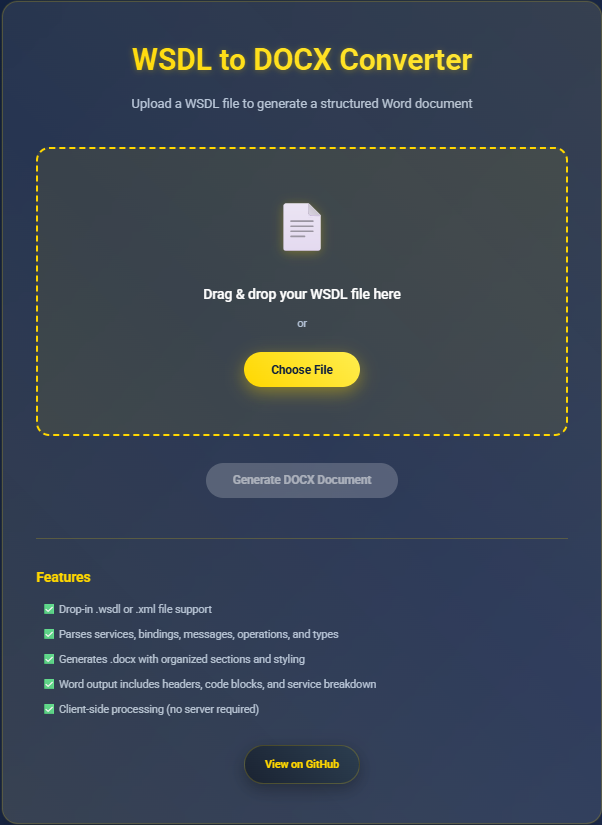

# 📝 WSDL to DOCX Documentation Generator

Generate beautiful `.docx` documentation from your WSDL files — right from your browser.

> 🔗 Pairs perfectly with [wsdl-to-xlsx-converter](https://github.com/m3hr4nn/wsdl-to-xlsx-converter) for comprehensive documentation in both Word and Excel formats.

---

## 🧩 Features

- ✅ Drop-in `.wsdl` or `.xml` file support
- ✅ Parses services, bindings, messages, operations, and types
- ✅ Generates `.docx` with organized sections and styling
- ✅ Word output includes headers, code blocks, and service breakdown
- ✅ Fully client-side — no uploads or backend required

---

## 🖥 Live Web App

🔗 **Try it now**: [https://m3hr4nn.github.io/wsdl-to-docx-converter](https://m3hr4nn.github.io/wsdl-to-docx-converter)

---

## 📸 Screenshots

Visit the [`screenshot/`](screenshot/) folder for examples of input/output. Here's a preview:

  

---

## 📁 Sample Input

Try the included example [`sample.wsdl`](sample.wsdl) file to see how complex WSDL files are parsed and transformed into clean Word documentation.

---

## 📦 Output Structure

The `.docx` output file includes:

- **Service Overview**
- **Operations and Port Types**
- **Messages and Parts**
- **Bindings and Transport**
- **Types (Complex & Simple)**
- **Raw XML Block (Optional)**

The formatting is compatible with most versions of Microsoft Word and LibreOffice.

---

## ⚠️ Notes

- This app is **entirely browser-based**.  
  🔐 No file is ever uploaded — all parsing and generation happens on the client side.
- Safe to use offline once loaded.

---

## 🤝 Contributing

Got improvements in layout, parsing, or formatting? PRs and suggestions are always welcome!  
Help make WSDL documentation easier and more accessible.

---

## 📄 License

This project is licensed under the MIT License.  
See the [LICENSE](LICENSE) file for more information.

---

## 👨‍💻 Author

Made with 💙 by [@m3hr4nn](https://github.com/m3hr4nn)

---
